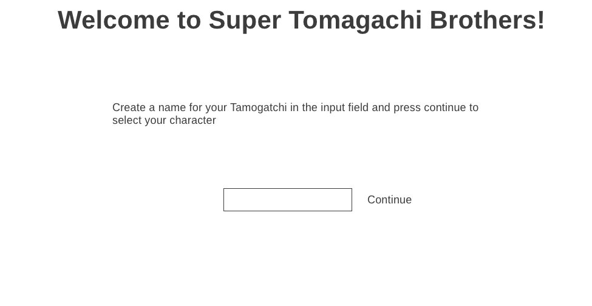
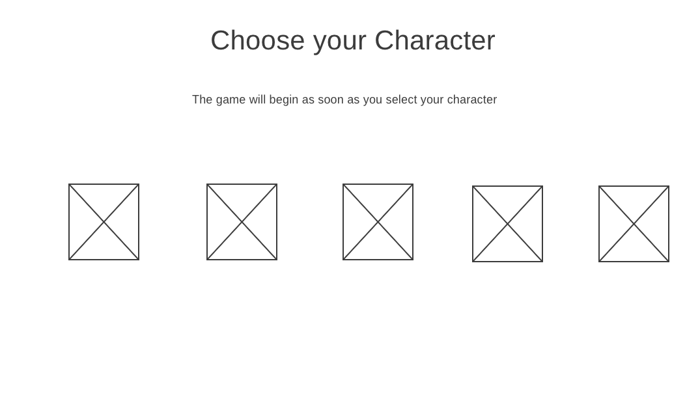
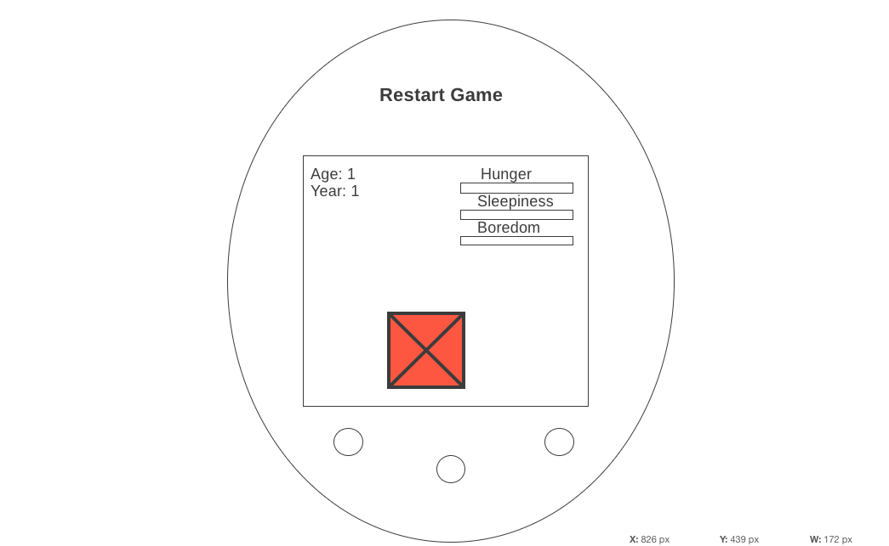

# Super Tamagotchi Bros

## User Story

Super Tamagotchi Bros will allow for its users to simulate the original Tamagotchi toy and nurture their own virtual character. The object of the game is to keep your character alive for as long as possible by keeping it fed, energized, and happy. Taking good care of your Tamagotchi will lead to it evolving at certain points during the game.

 The game will be themed around one of the most popular video game series ever made, Super Mario Brothers. 

 Users will land on the "Welcome to Super Tamagotchi Bros" page where they will be able to give a name to their character. After entering a name and pressing the continue button, they will be directed to the "Choose Character" page.

 On the "Choose Character" page, users will be able to choose from the baby versions of Mario, Luigi, Princess Peach, Donkey Kong, and Bowser. Upon selecting a character, the Tamagotchi "device" will appear and the game will begin.

 When the game begins, the user will see the character that they selected inside of the Tamagotchi device screen. The name and age of the Tamagotchi will be displayed in the top left hand corner of the screen. At ages 5 and 10, the Tamagotchi will evolve into a new version of itself. There will also be progress bars that display how satiated, energized, and happy the Tamagotchi is. These bars will continuosly decrement as the game goes on. The user will have to monitor these bars and make sure that they never become fully depleted or else their Tamagotchi will die.
 
 On the bottom of the device, there will be four buttons that allow for the user to put their Tamagotchi to sleep, feed it, play with it, and walk it. Clicking these buttons will increase the value of the corresponding progression bar and trigger an animation. On the top of the device there will be a reset button that can be pressed at any time to take the user back to the "Welcome to Super Tamagotchi Bros" page. This will be how users can start a new game when their Tamagotchi dies or when they decide that they want to use a different character. 

## Wireframes

### Landing Page

This is where the user will start when starting the game. After naming their Tamagotchi they will be redirected to the select character page.

### Select Character Page

On this page there will be a selection of characters for the user to choose from. These will all be baby versions of characters from the Super Mario Brothers Series. After selecting a character, the game will automatically start.

### Game Screen

This is where the actual game will be played. The buttons on the Tamagotchi will trigger various animations and increase the value of the characters "progression bars". Other features will include a "Reset" button to start the game over at any time, and a "Randomize Device Color" button that users can use to change up the color of their device.

